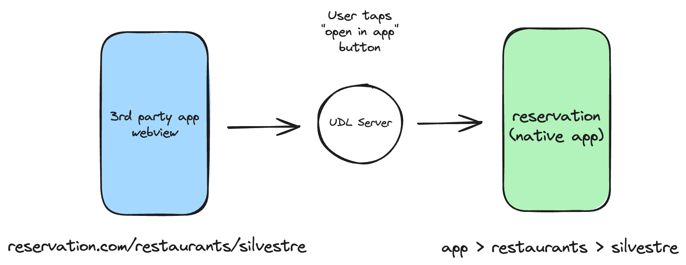
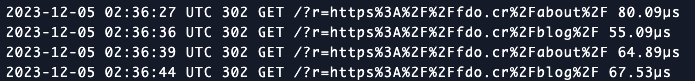

# Universal Deep Link (UDL) Server

[](https://github.com/fdocr/udl-server/actions/workflows/ci.yml/badge.svg?branch=main)

This is a server that bounces traffic to better leverage Deep Linking in mobile apps.

The project's objectives are to be a simple, effective and lightweight tool that can help any website provide a seamless integration with associated mobile apps.

## How it works

Modern mobile browsers provide developers with [Universal Links (iOS)](https://developer.apple.com/library/archive/documentation/General/Conceptual/AppSearch/UniversalLinks.html) or [Android Intents](https://developer.chrome.com/docs/multidevice/android/intents/) to support deep linking users from a website directly into a mobile app.

However, **do you share links to your website on social media or other 3rd party apps?** Your website will likely be browsed on a webview (embedded browser) inside a 3rd party app, i.e. Instagram, TikTok, Reddit, etc. This means iOS Universal Links won't open your app automatically because users are clicking links on the same domain.

> When a user is browsing your website in Safari and they tap a universal link to a URL in the same domain as the current webpage, iOS respects the user’s most likely intent and opens the link in Safari. If the user taps a universal link to a URL in a different domain, iOS opens the link in your app. ([reference docs](https://developer.apple.com/library/archive/documentation/General/Conceptual/AppSearch/UniversalLinks.html))

This is how the UDL Server helps make this a smooth experience for you:



It's a dead simple pivot server that will allow for Universal Links to trigger wherever your users are browsing from.

## Usage

Following the **"reservation"** example app from the diagram above (assuming you support Universal Links already) all you need is to add a button (link) on your website that reads "open in app" requesting a redirect to your target location:

```
https://udl.fdo.cr/?r=https://reservation.com/restaurants/silvestre
```

This will bypass the limitation of Safari (embedded webview) that doesn't allow your Universal Links to trigger. You should now have a working "open in app" UX.

### Default destination support
If the `DEFAULT_DESTINATION` environment variable is set and no `r` query parameter is provided:

- A request to the root path:

    - `https://udl.fdo.cr/` will redirect to `DEFAULT_DESTINATION`

- A request with a path:

    - `https://udl.fdo.cr/restaurants/silvestre` will redirect to `DEFAULT_DESTINATION + "/restaurants/silvestre"`

The original `?r=` format continues to work as before. If `DEFAULT_DESTINATION` is not set, behavior remains unchanged.


`https://udl.fdo.cr` is a **public (free to use) UDL Server** instance for anyone to try out and use on your own. It has usage limits (throttling), which should be more than enough for most low-medium traffic websites.

If this service adds value to you or your company please consider sponsoring me right here on GitHub. I offer different sponsor tiers too where I will host a private instance without usage limits for ensured reliability. [Read more about this on my profile](https://github.com/sponsors/fdocr) to support the OSS work I do on my free time.

## Self host

The project makes it easy for you to self host a UDL Server. The easiest way to do this is to:

1. Fork this repository
1. Configure a PaaS to automatically deploy from your fork repository
1. Configure your custom domain/sub-domain
1. Keep up with upstream (this repo) for future updates
   - Use the **"Sync fork"** feature in your GitHub repo
   - Or manually using git
1. Customize your deployment using ENV variables
   - `THROTTLE_LIMIT`
      - Number of requests allowed per `THROTTLE_PERIOD`
      - i.e. `30` (default is `5`)
   - `THROTTLE_PERIOD`
      - Period to track requests to be throttled in seconds
      - i.e. `60` (default is `30`)
   - `SAFELIST`
      - Space separated list of domains for private instance usage
      - i.e. `"fdo.cr github.com"` (if set it will disable throttling)
   - `DISABLE_DEFENSE`
      - Disable throttle/safelist feature
      - i.e. `"true"`
   - `AASA_APP_IDS`
      - Enable activity continuation and other [associated domain features](https://developer.apple.com/documentation/xcode/supporting-associated-domains)
      - i.e. `ABCDE12345.com.example.app`

Alternatively you can run the lightweight [`fdocr/udl-server`](https://hub.docker.com/repository/docker/fdocr/udl-server) Docker container on your own. At the time of this writing the docker image is only about `26.3 MB` in size (`10.87 MB` compressed).

## Troubleshooting

Some common details to keep in mind in case your redirects aren't working properly:

- Make sure your redirects are all using `https`
- If links aren't working try to use `target="_blank"` on your anchor tag
- Make sure your iOS app has properly configured [Associated Domains](https://developer.apple.com/documentation/safariservices/supporting_associated_domains) for the websites you want to support.
   - There's a chance it won't work in development mode (i.e. only signed with a Production certificate). I suggest releasing to TestFlight in order to properly test everything.

## Performance & Roadmap

The project was originally written using [Ruby](https://www.ruby-lang.org/en/) & [Sinatra](https://sinatrarb.com/). It was a joy to write and worked perfectly fine, but I always wanted this "pivot request" to be as instantaneous as possible. It was doing `~40 ms` response times for `P99` on less than 1 rpm but supporting consistent daily traffic.

The project is now ported to [Crystal](https://crystal-lang.org/) and [Kemal framework](https://kemalcr.com/). I'm now seeing response times drop to microseconds, which is very exciting!



I'm aiming to work on adding a bunch of other features to the project and [share blog posts](https://fdo.cr/blog) with walkthroughs/benchmarks/etc. Feel free to tag along and submit feature requests in the issue tracker.

## Contributing

Please check out the [Contributing Guide](https://github.com/fdocr/udl-server/blob/main/CONTRIBUTING.md).

## Code of Conduct

This project is intended to be a safe, welcoming space for collaboration, and contributors are expected to adhere to the [Code of Conduct](https://github.com/fdocr/udl-server/blob/main/CODE_OF_CONDUCT.md).

## License

Released under an [MIT License](https://github.com/fdocr/udl-server/blob/main/LICENSE.txt)
