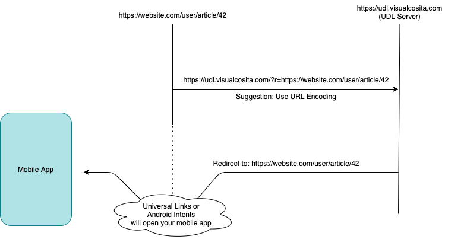

# Universal Deep Link (UDL) Server

This is a server that bounces traffic to better leverage Deep Linking in mobile apps.

The project's objectives are to be a simple, effective and lightweight tool that can help any website provide a seamless integration with their mobile apps.

## How it works

A dead simple pivot server that will redirect to whatever you pass in the `r` query param to the root path.

## Troubleshooting

Some common details to keep in mind in case your redirects aren't working properly:

- You will likely need to make this request on a `target="_blank"` anchor tag in order to get Apple's Universal Links to work.
- Make sure your iOS app has properly configured [Associated Domains](https://developer.apple.com/documentation/safariservices/supporting_associated_domains) for the websites you want to support.
   - There's a chance it won't work in development mode (i.e. only signed with a Production certificate). I suggest releasing to TestFlight in order to properly test everything.

## Current State

Very early development but this could end up being a helpful tool.

- [x] Apple Universal Links support
- [ ] Android Intents support
- [x] Add fallback page
- [ ] Rule-based filtering (ENV variable)
